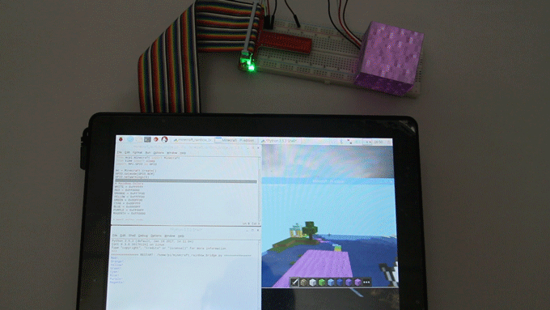

## minecraft-pi-rainbow-bridge

Quick Links:

 * [About minecraft-pi-rainbow-bridge](#about_this_script)
 * [Update](#update)
 * [About SunFounder](#about_sunfounder)
 * [License](#license)
 * [Contact us](#contact_us)

### About minecraft-pi-rainbow-bridge:

This is a simple script for minecraft-pi. the script reads the block under the player, if it's wool, light up the RGB module with the wool color. 

### Update:
2018-02-05:
 - New Release

----------------------------------------------

### About SunFounder
SunFounder is a technology company focused on Raspberry Pi and Arduino open source community development. Committed to the promotion of open source culture, we strives to bring the fun of electronics making to people all around the world and enable everyone to be a maker. Our products include learning kits, development boards, robots, sensor modules and development tools. In addition to high quality products, SunFounder also offers video tutorials to help you make your own project. If you have interest in open source or making something cool, welcome to join us!

----------------------------------------------

### License
This program is free software; you can redistribute it and/or modify it under the terms of the GNU General Public License as published by the Free Software Foundation; either version 2 of the License, or (at your option) any later version.

This program is distributed in the hope that it will be useful, but WITHOUT ANY WARRANTY; without even the implied wa rranty of MERCHANTABILITY or FITNESS FOR A PARTICULAR PURPOSE. See the GNU General Public License for more details.

You should have received a copy of the GNU General Public License along with this program; if not, write to the Free Software Foundation, Inc., 51 Franklin Street, Fifth Floor, Boston, MA 02110-1301 USA.

minecraft-pi-rainbow-bridge comes with ABSOLUTELY NO WARRANTY; for details run ./show w. This is free software, and you are welcome to redistribute it under certain conditions; run ./show c for details.

SunFounder, Inc., hereby disclaims all copyright interest in the program 'minecraft-pi-rainbow-bridge' (which makes passes at compilers).

Mike Huang, 21 August 2015

Mike Huang, Chief Executive Officer

Email: service@sunfounder.com, support@sunfounder.com

----------------------------------------------

### Contact us:
website:
	www.sunfounder.com

E-mail:
	service@sunfounder.com, support@sunfounder.com
